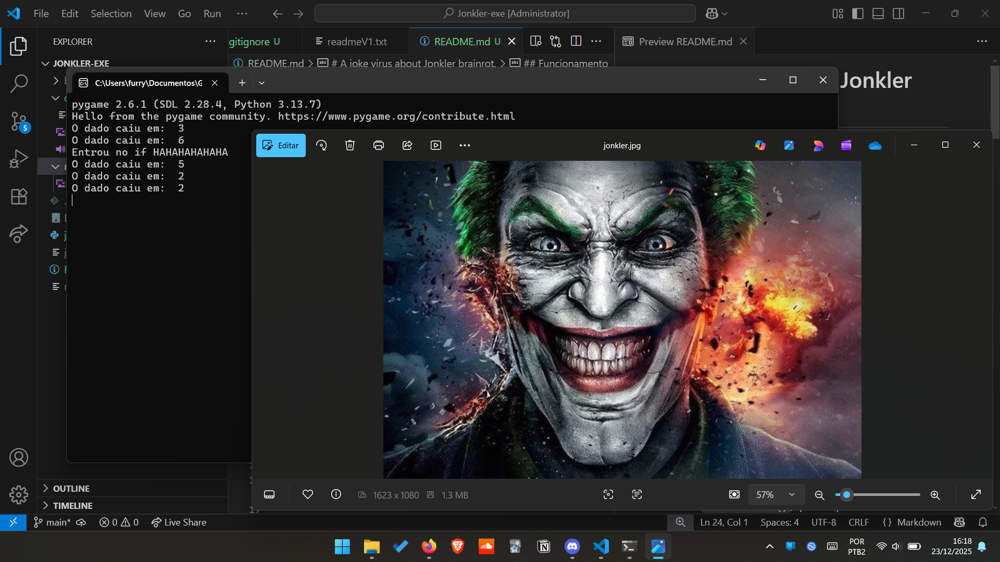
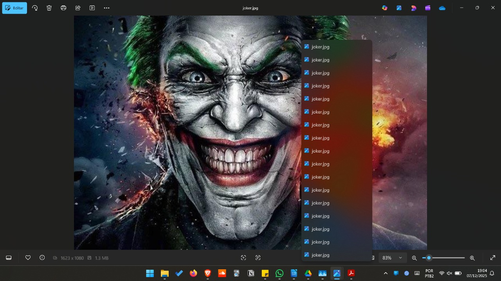
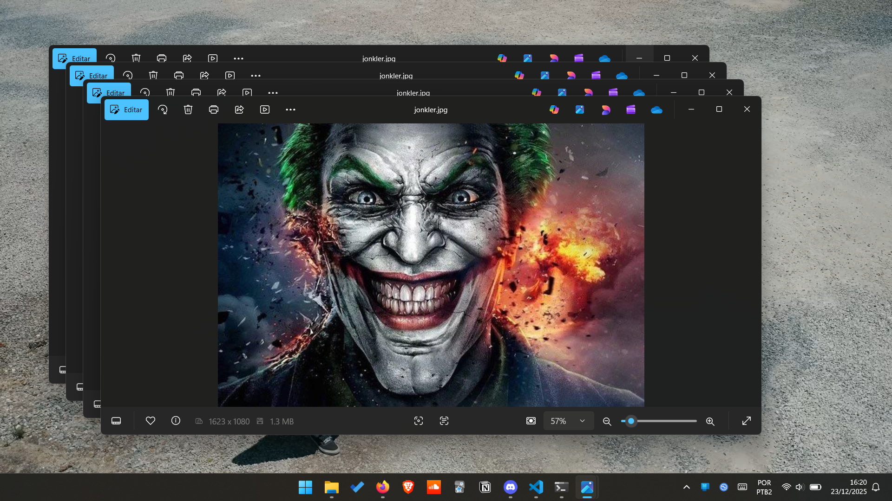
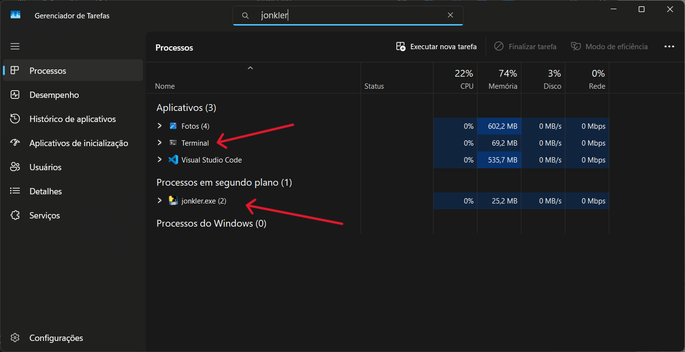
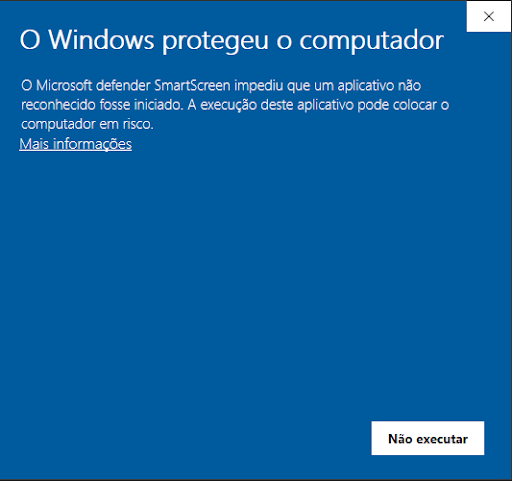

# A joke virus about Jonkler brainrot.

> [!Note]
> [Clique aqui para ver como fechar o jonkler-exe manualmente!](#como-fechar-o-jonklerexe-x-hocho).

## Introdução :telescope:
Esse programa se trata de um joke virus, (vírus de piada), feito com o único objetivo de assustar/irritar ou até mesmo divertir o usuário, ativando aleatoriamente enquanto o usuário utiliza o computador, inspirado no meme brainrot do Jonkler.

Existem várias versões do meme, mas caso você não conheça [clique aqui](https://youtu.be/gQD2IZItlVk?si=GbXSLz6gw0xp39Fh) para ver uma das versões.

## Sistemas Operacionais Compatíveis :computer: :window:
O programa funciona nos seguintes sistemas operacionais:

- Windows 10
- Windows 11

O código não funciona no Linux, pois utiliza uma função chamada ```os.startfile()```, que é específica do Windows.

Outras versões do Windows, (como o 7 ou 8) não foram testadas.

## Funcionamento :game_die:
Ele inicia um loop infinito, onde ele atribui a variável ```dado``` um número aleatório entre 1 a 6 através da função ```random.randint(1, 6)```, e se a variável foi igual ao valor 6, então ele abre uma imagem do meme do jonkler e toca o áudio do meme, caso contrário ele não faz nada, depois disso, ele espera um tempo e repete tudo novamente.

O tempo de espera entre os lançamentos do dado é configurado na variável ```delay```, que recebe o tempo de espera em segundos, ou seja, se ```delay = 10```, então ele **espera 10 segundos**.

A ideia é que o programa rode em segundo plano, deixando nenhuma suspeita de que ele está em execução, mas como o código está em desenvolvimento, ele vai abrir um terminal, que mostra o valor da variável ```dado``` e se entrou na condição de ativação.

## Capturas de Tela :camera:
Quanto mais tempo o programa rodar, mais imagens ele vai abrir.









## Atenção :warning:
Tudo o que o programa faz pode ser revertido sem precisar de nenhum segredo ou qualquer habilidade de _um grande mago que anda pra cima e para baixo com seus pergaminhos_, tudo o que você precisa saber é como fechar janelas e como abrir o gerenciador de tarefas para encerrar o programa.


> [!WARNING]
> <mark>**Mesmo que o programa seja inofensivo, eu não me responsabilizo por qualquer danos causados ao seu computador ou de outras pessoas.**</mark>

E caso você não saiba como usar o Gerenciador de Tarefas para encerrar um programa, tudo bem, eu te ensino abaixo como fazer isso, passo a passo [clicando aqui](#como-fechar-o-jonklerexe-x-hocho).

## Possiveis erros de execução :x:
Segundo alguns testes em outros computadores (Windows 11 e 10), o código pode ser bloqueado pelo **Microsoft Defender SmartScreen**, como exemplifica a imagem abaixo:



_(e não, eu não sei o que fazer para esse erro parar de acontecer)_, mas se a opção estiver disponível, você pode clicar em ```Mais informações``` e depois em ```Executar assim mesmo```, assim o código vai ser executado.

## Como fechar o jonkler.exe :x: :hocho:
Clique com o botão direito do mouse sobre a barra de tarefas e depois clique em ```Gerenciador de Tarefas```, **ou** aperte as teclas ```Ctrl``` + ```Shift``` + ```esc``` simultâneamente.

Após isso, clique na aba ```Processos```, (é a 1° aba), e em ```Processos em Segundo Plano``` procure até encontrar pelo nome ```jonkler.exe```, (que é o nome do programa), para encerrar, clique em cima do nome ```jonkler.exe```, e depois clique em um botão chamado ```Finalizar tarefa```, esse botão está embaixo no Windows 10 e em cima no Windows 11.

Caso não esteja encontrando o processo (e você use o Windows 11), você pode buscar ele de uma forma mais simples, que é pesquisando pelo nome ```jonkler``` na barra de busca do Gerenciador de Tarefas e aí encerrando ele, (como expliquei acima). Ou o código pode ter simplesmente bugado e fechado sozinho, já aconteceu algumas vezes...

Lembre-se, encerrar o programa não fechará as imagens que ele abriu, sendo nescessário fecha elas manualmente.

## Agradecimentos :muscle: :pray:
Agradeço profundamente aos meus amigos que testaram o meu código na máquina deles e compartilharam feedback :heart:

- [davi-goncalves](https://github.com/Davi-Gon)
- [heittorknielingm](https://github.com/heittorknielingm)
- [Zathexko](https://steamcommunity.com/id/Andrezat) <- Steam
- [pudimlucasd](https://steamcommunity.com/profiles/76561199074291946) <- Steam

_FR!_
