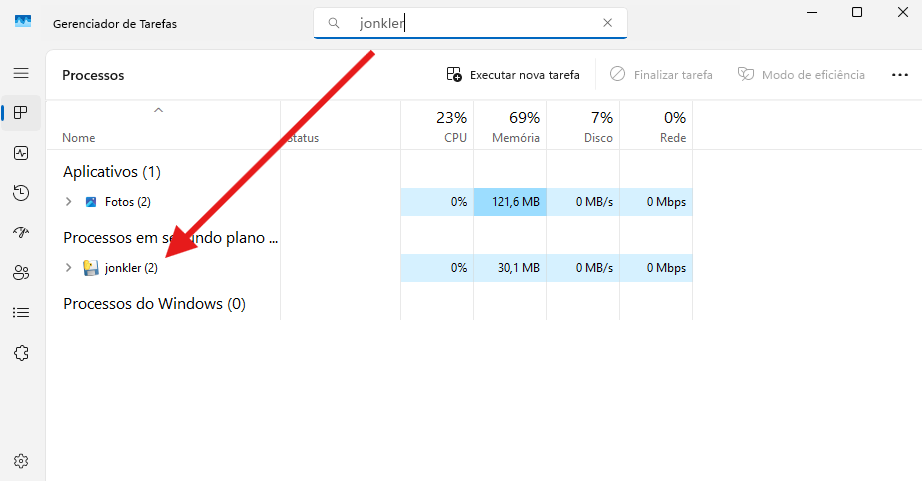

# A joke virus about Jonkler brainrot.

## Introdução :telescope:
Esse programa se trata de um joke virus, e é ativando aleatoriamente enquanto o usuário utiliza o computador, inspirado no meme brainrot do Jonkler.

## Sistemas Operacionais Compatíveis :computer: :window:
Os softwares funciona nos seguintes sistemas operacionais:

- Windows 11
- Windows 10

**O jonkler.exe não funciona no Linux**, já outras versões do Windows, como o 7 ou 8 não foram testadas.

## Funcionamento 
### (jonkler.exe) :game_die: :black_joker:
Ele inicia um **loop infinito**, onde ele atribui a variável ```dado``` um número aleatório entre 1 a 6 através da função ```random.randint(1, 6)```, após isso, ele verifica:

- Se ```dado``` for igual a ```3```, então ele abre uma imagem, toca um áudio relacionado a imagem, abre um meme de uma pomba (a ave) e a página da Wikipédia sobre rolas-roxas, (a ave, é claro), depois ele espera alguns segundos e sorteia mais um número aleatório.

- Se ```dado``` foi igual ao valor ```6```, então ele abre uma outra imagem, toca outro áudio e abre um gif do joker, (de uma parte aleatória do filme), depois ele aguarda alguns segundos e sorteia mais um número aleatório.

- Caso ```dado``` não seja igual a ```3``` ou a ```6```, então ele não faz nada, apenas espera alguns segundos e repete o loop.

O tempo de espera entre os lançamentos do dado é configurado na variável ```delay```, e no momento ```delay``` é igual a ```20```. Isso dá + ou - 1 ativação por minuto.

Tudo isso operando em **segundo plano**.

### (Batman.exe) :bat: :hocho:
Ele basicamente fecha o jonkler.exe através do comando abaixo:

```taskkill /F /IM jonkler.exe```

E para fechar as imagens, ele utiliza o comando:

```taskkill /F /IM Photos.exe```

Onde:

- ```taskkill``` -> Fechar o processo
- ```/F```       -> Força a ação
- ```/IM```      -> Permite buscar pelo nome do programa, ao invés de buscar pelo PID
- ```<nome do software.exe>``` -> Nome do programa a ser encerrado.

Ele consegue fechar as imagens caso você utilize o **Fotos** da Microsoft como app padrão para abri-las, senão ele apresenta uma mensagem de erro, dizendo que não encontrou as imagens.

E caso o jonkler não esteja aberto, ou o comando tenha apresentado erro, ele exibe o link para acessar o tutorial de como fechar o jonkler.exe manualmente, o mesmo se encontra neste README.

## Capturas de Tela :camera:
Quanto mais tempo o programa rodar, mais imagens serão abertas.




## Atenção :warning:
Tudo o que o programa faz pode ser revertido sem nenhum segredo, _ou qualquer habilidade de um grande mago que anda pra cima e para baixo com seus pergaminhos_, tudo o que você precisa saber é como usar o gerenciador de tarefas para encerrar o programa, (caso o Batman.exe não funcione).

> [!WARNING]
> <mark>**Mesmo que o programa seja inofensivo, eu não me responsabilizo por quaisquer danos causados ao seu computador ou de terceiros.**</mark>

## Como executar o jonkler.exe? :arrow_forward: :black_joker:

Após extrair os arquivos, abra a pasta ```jonkler-virus``` e execute o ```jonkler.exe```, não precisa abrir como Administrador.

## Possivel erro de execução :x:
Segundo testes em outros computadores (Windows 10 e 11), o jonkler.exe e o Batman.exe são bloqueados pelo **Microsoft Defender SmartScreen**, como exemplifica a imagem abaixo:


Se a opção estiver disponível, clique em ```Mais informações``` e depois em ```Executar assim mesmo```, assim o código vai ser executado.

## Como fechar o jonkler.exe? :x: :hocho:

### Forma automática (Batman.exe) :bat:
Execute o ```Batman.exe```, não precisa abrir como Administrador, ele deve fechar o **jonkler.exe** e as imagens abertas.

### Forma manual :writing_hand:
Clique com o botão direito do mouse sobre a barra de tarefas e depois clique em ```Gerenciador de Tarefas```, **ou** aperte as teclas ```Ctrl``` + ```Shift``` + ```esc``` simultâneamente.

Após isso, clique na aba ```Processos```, e procure até encontrar pelo ```jonkler.exe``` em ```Processos em Segundo Plano```, para encerrar, clique em cima do nome ```jonkler.exe```, e depois clique em um botão chamado ```Finalizar tarefa```, esse botão está embaixo no Windows 10 e em cima no Windows 11.

Caso não esteja encontrando o processo (e você use o Windows 11), você pode buscar ele de uma forma mais simples, que é pesquisar por ```jonkler``` na barra de busca do Gerenciador de Tarefas.

Ou o código pode ter simplesmente bugado e fechado sozinho, por alguma razão...

## Agradecimentos :muscle: :pray:
Agradeço profundamente aos meus amigos que testaram o meu código na máquina deles e compartilharam feedback, amo vocês :heart:

- [davi-goncalves](https://github.com/Davi-Gon)
- [heittorknielingm](https://github.com/heittorknielingm)
- [Zathexko](https://steamcommunity.com/id/Andrezat) <- Steam
- [pudimlucasd](https://steamcommunity.com/profiles/76561199074291946) <- Steam

_FR!_
